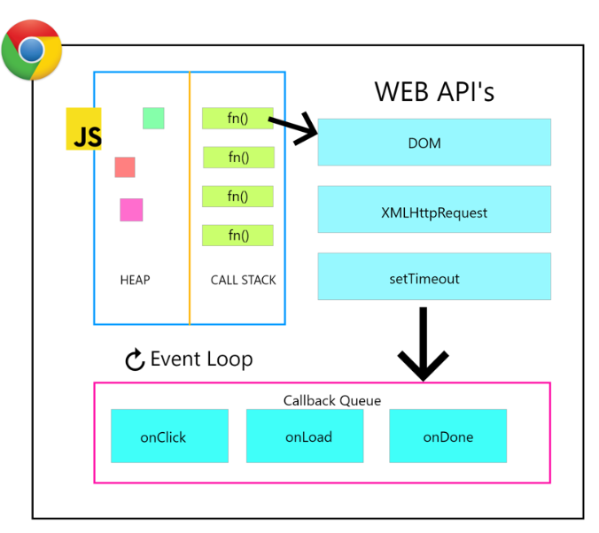
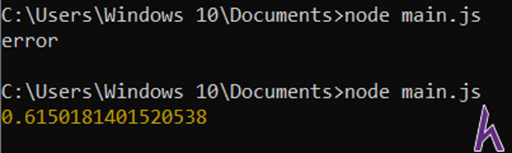
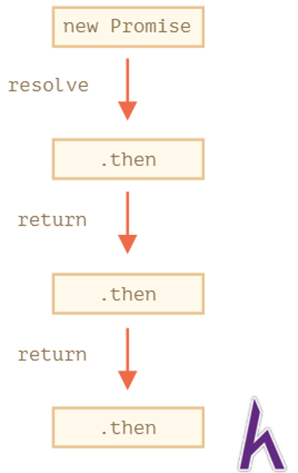
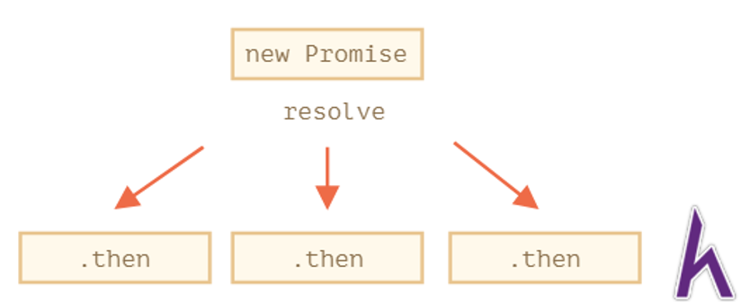
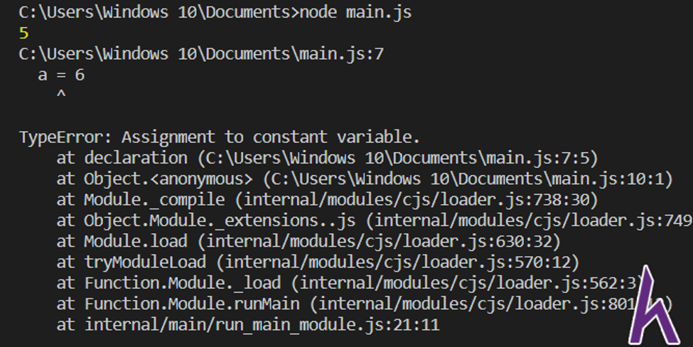
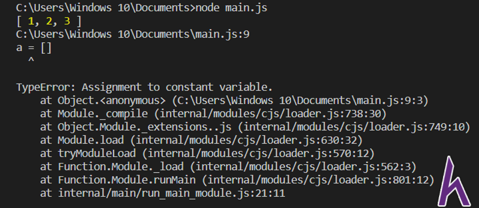
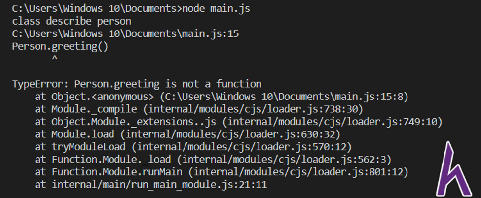
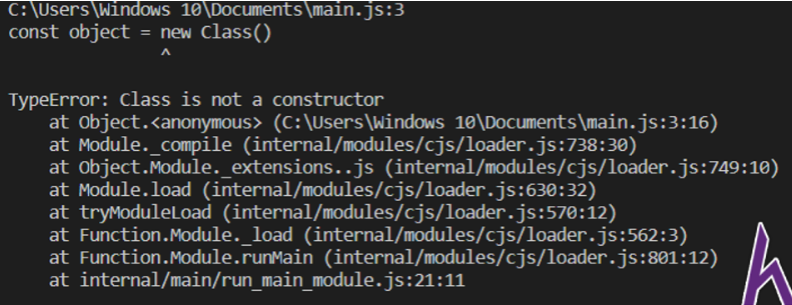
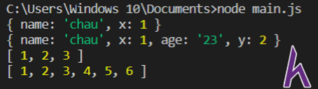
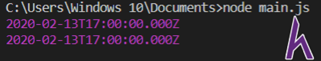

# ECMAScript là gì ? (ES)

- Tiêu chuẩn ECMAScript (viết tắt là ES) là một trong những tiêu chuẩn của ngôn ngữ Javascript khá phổ biến nhất hiện nay. Ta sẽ xem lại lịch sử ra đời của tiêu chuẩn nay:

- Vào thời kỳ cạnh tranh thị phần trình duyệt, Brendan Eich đã phát triển một ngôn ngữ đặc tả kịch bản cho trình duyệt Netscape, lúc đầu gọi là Mocha, rồi sang LiveScript rồi cuối cùng thành Javascript.
12-1995, Sun Microsystem và Netscape công bố Javascript, 3-1996 trình duyệt Netscape 2.0 đã hỗ trợ ngôn ngữ này. Tuy nhiên Microsoft cũng ra mắt một ngôn ngữ tương tự là JScript hỗ trợ cho trình duyệt IE 3.0 (việc đổi tên để tránh bản quyền)
- Netscape đã đưa Javascript tới ECMA International, đây là một tổ chức chuẩn hóa thông tin và hệ thống giao tiếp. Và việc chuẩn hóa ngôn ngữ Javascript được gọi là ECMA-262. Rồi cái tên ECMAScript hình thành từ đây
- Trong quá trình hình thành và phát triển tiêu chuẩn này, bước ngoặt lớn nhất là 2015, tiêu chuẩn ECMAScript 6 (ES6, ES2015) đánh dấu sự thay đổi rất lớn ngôn ngữ Javascript về cú pháp lẫn tính năng.

> Ngoài tiêu chuẩn ECMAScript là tiêu chuẩn phổ biến, thì có những tiêu chuẩn cũng có tiếng khác như Typescript.

# Cơ chế bất đồng bộ 

## Xử lý đồng bộ (Synchronous)

- Khi dòng code hoàn thành thì mới chạy dòng code tiếp theo.
- Nếu dòng code thực hiện quá lâu sẽ chuyển sang trạng thái chờ.

## Xử lý bất đồng bộ (Asynchronous)
- Có thể bỏ qua trạng thái chờ nếu không cần thiết và thực hiện các dòng code tiếp theo.
- Mặt tốt : giúp chúng ta xử lý nhiều công việc xen kẽ với nhau để tiết kiệm thời gian. 
- Mặt xấu là làm chương trình mình viết phức tạp lên, và ta phải hiểu rõ nguyên lý hoạt động của bất đồng bộ, nếu không sẽ dính những trường hợp như cái tiền đề chưa làm mà đã xử lý cái kết quả.

### Cơ chế hoạt động của Javascript.
- Call Stack: Vùng nhớ đặc biệt trên chip máy tính nhằm để phục vụ thực thi các dòng lệnh (cụ thể ở đây là các hàm). Stack là hàng đợi theo kiểu LIFO (Last In First Out) nghĩa là cái gì vào cuối thì ra đầu.
- Heap: vùng nhớ dùng để chứa kết quả tạm thời để thực thi các hàm trong stack.
- Callback Queue / Message Queue: khi các dòng lệnh cần thời gian chờ, ta sẽ khai báo các function callback xử lý sau khi dòng lệnh đó đã hoàn thành. Thì các task đó sẽ được đẩy vào đây. Queue là hàng đợi theo kiểu FIFO (First In First Out) có nghĩa cái gì vào trước là xử lý trước.
- Event Loop: có thể giải thích đơn giản là nó là một vòng lặp vô tận, và chỉ 1 công việc duy nhất là lấy các task từ Call Stack hoặc Callback Queue. Đầu tiên sẽ xử lý CallStack trước, sau khi Call Stack trống thì nó sẽ kiểm tra Callback Queue để thực hiện.

    
    
## Promise
- Promise object đại diện cho việc hoàn thành kết quả (hoặc sự thất bại) từ một lệnh bất đồng bộ, và giá trị kết quả của lệnh đó.

- Mục đích của Promise là cơ chế của nó giúp bạn thực hiện các tác vụ đồng bộ hơn và tránh rơi vào tình trạng callback hell hay pyramid of doom, là tình trạng dùng các callback lồng nhau quá nhiều .
- Ta sẽ tạo promise object thông qua class Promise, class Promise lúc khởi tạo sẽ chứa 1 function để thực thi các tác vụ bất đồng bộ. Function sẽ có 2 tham số:

    - resolve: hàm được gọi khi promise hoàn thành.
    - reject: hàm được gọi khi có sự cố.

```js

var promise = new Promise(function(resolve, reject) {

    setTimeout(function() {
    
        resolve('foo');
    
    }, 1000);
    
});
    
promise.then(function(value) {
    
    console.log(value);
    
});
    
console.log(promise);
```

- Ta sẽ tạo ra một promise object; tại function bên trong, ta hẹn sau 1 giây sẽ gọi function resolve với kết quả ‘foo’.
- Để xử lý khi promise có kết quả ta sẽ dùng phương thức then, rồi viết callback trong đó log ra value khi mà có kết quả.

### Cơ chế hoạt động của Promise

- Một Promise có 1 trong 3 trạng thái sau:

    -pending: trạng thái khởi tạo.
    -fulfilled: có nghĩa thao tác đã hoàn thành thành công.
    -rejected: có nghĩa là thao tác thất bại.
-Một promise pending có thể thành fulfilled với kết quả, hoặc thành rejected với nguyên nhân (error). Khi option đó diễn ra, các handler liên quan sẽ thực hiện.
    
- Ví dụ: Ta sẽ thử viết 1 Promise hoàn chỉnh có then và catch
```js

var promise = new Promise(function(resolve, reject) {

  var value = Math.random()

  if (value > 0.5) {

    resolve(value)

  }

  reject('error')

});


promise.then(function(value) {

  console.log(value)

}).catch(function(error) {

  console.log(error)

})
```
- Ta lấy 1 giá trị ngẫu nhiên, nếu lớn hơn 0.5 thì resolve nó ra, còn không thì reject lỗi.

    

- Ngoài ra, ta có thể viết như thế này:
```js
var promise = new Promise(function(resolve, reject) {
  var value = Math.random()
  if (value > 0.5) {
    resolve(value)
  }
  reject('error')
});

function onSuccess(value) { console.log(value) }
function onError(error) { console.log(error) }
promise.then(onSuccess, onError)
```

### Tại sao phải sử dụng Promise?


- Khi mà ta sử dụng callback function, ta phải viết callback xử lý tính toán ngay lập tức (khi mà thực hiện các thao tác bất đồng bộ) nên khi mà xảy ra quá nhiều thao tác bất đồng bộ đang diễn ra, sẽ dẫn đến tình trạng các callback function lồng vào nhau.

- Còn ở Promise, nó làm 1 bản cam kết sẽ thực hiện trong tương lai, ta không cần phải viết xử lý then ngay lập tức mà có thể để promise object lại đến khi sau này cần mới thực hiện.

- Ví dụ: Ta cần chạy lệnh bất đồng bộ nhưng chưa cần viết hàm xử lý khi có kết quả.
```js
var promise = new Promise(function(resolve, reject) {
   setTimeout(function callback() {
       console.log(8)
       resolve(8)
   }, 3000)
}) //8
```

- Khi chạy kết quả ta có thể thấy giá trị log 8 đã thực hiện, có nghĩa khi ta tạo một object promise, thì thao tác bất đồng bộ đã được thực hiện. Và khi resolve hay reject thì kết quả của xử lý bất đồng bộ này vẫn được lưu lại trong promise. Khi nào cần thì ta có thể viết hàm xử lý kết quả này.

- Promise có thể hiểu là 1 biến chứa kết quả cuộc 1 lần thực hiện bất đồng bộ. Nó khác với các xử lý callback là ta có thể mang vác cái biến này đi khắp nơi trong code mà ta thấy phù hợp. Tại đó gọi hàm then chứa callback xử lý.

- Vậy khi xử lý quá nhiều lệnh bất đồng bộ thì sao. lúc đó mỗi bất đồng bộ là một object promise, ta sẽ gom các promise này lại rồi xử lý tại promise all như sau:
```js

var promise1 = new Promise(function(resolve, reject) {
   setTimeout(function callback() {
       resolve(8)
   }, 3000)
})

var promise2 = new Promise(function(resolve, reject) {
   setTimeout(function callback() {
       resolve(2)
   }, 1000)
})

Promise.all([promise1, promise2]).then(function (values)  {
    console.log(values)
});
// [ 8, 2 ]
```
- Như vậy, ta đã tránh được tình trạng callback hell khi có thể tách biệt các xử lý bất đồng bộ ra riêng cho đến khi tất cả kết quả bất đồng bộ đã có.

> Lưu ý: Nếu trong một các promise có lỗi, thì promise.all sẽ xử lý phần catch thay vì xử lý then.
### Promise chaining
- Promise còn hỗ trợ cho chúng ta một kỹ thuật khá hay giúp ta kết nối các promise liên tiếp lại với nhau. Vì phương thức then (ở trường hợp promise thành công) khi return giá trị thì nó sẽ tạo một promise khác bọc lại giá trị đó, ta có thể tạo nên phương thức then phía sau để kết nối tiếp.

    

```js
new Promise(function(resolve, reject) {
  setTimeout(() => resolve(1), 1000);
}).then(function(result) {
  console.log('1:'+result)
  return result + 1
}).then(function(result) {
  console.log('2:'+result)
  return new Promise(function(resolve, reject) {
      setTimeout(() => resolve(result * 2), 1000);
  });
}).then(function(result) {
  console.log('3:'+result)
});
// 1:1
// 2:2
// 3:4
```

- _Lưu ý_: Promise chaining phải cho các phương thức then nối liền nhau mới xử lý tuần tự. Tránh trường hợp viết như thế này:

```js
var promise = new Promise(function(resolve, reject) {
  setTimeout(function () { resolve(1) }, 1000);
})

promise.then(function(result) {
  console.log(result); // 1
  return result * 2;
});

promise.then(function(result) {
  console.log(result); // 1
  return result * 2;
});

promise.then(function(result) {
  console.log(result); // 1
  return result * 2;
});
```

- Bản chất, ta đang viết 3 phương thức xử lý kết quả của promise đó:
    

## Async/Await là gì?
- Async/Await là một tính năng ra đời từ ES7 nhằm giúp ta code bất đồng bộ nhìn trong đồng bộ hơn, giúp code dễ nhìn hơn và dễ sử dụng. Trong đó:

    - Async function là một khái niệm định nghĩa cho hàm bất đồng bộ. Hàm bất đồng bộ này sẽ thực hiện tách rời so với phần code còn lại của Event Loop, và trả về một Promise. Cú pháp và cấu trúc của Async function làm nhìn giống chuẩn các hàm đồng bộ.
    - Await là một cú pháp giúp tạm dừng (block) code để đợi lấy kết quả từ một Promise (Await không hoạt động với callback), và Await chỉ sử dụng được khi nằm trong Async function.
- Ví dụ: Ta sẽ viết 1 function dùng Async/Await để xử lý 1 Promise

    - Khai báo function returnPromise khi gọi sẽ return 1 promise, sau 3 giây thì promise sẽ resolve kết quả.
    - Khai báo function asyncFunction dùng tính năng async/await, khi gọi function returnPromise  sẽ dùng await để đợi kết quả.

```js
function returnPromise() {
    return new Promise(function(resolve,reject) {
      setTimeout(function() {
        resolve('finished')
      }, 3000)
    })
}
async function asyncFunction() {
  console.log('calling')
  var result = await returnPromise()
  console.log(result)
}
asyncFunction()
console.log('kteam')
//calling
//kteam
//finished
```
- Như vậy:

    - Khi gọi asyncFunction đầu tiên thì chương trình sẽ log ‘calling’, nhưng khi chương trình await nên chương trình thực hiện log ‘kteam’ tiếp theo.
    - Sau 3 giây thì returnPromise có kết quả, lúc đó asyncFunction thực hiện tiếp phần code còn lại.
## Async/Await và Promise
- Nếu chúng ta xem qua, sẽ nghĩ rằng khi sử dụng Async/Await thì không cần phải sử dụng Promise nửa. Cũng không hẳn là vậy, vì bản chất khi ta sử dụng Async/Await chính là ta sử dụng gián tiếp Promise, khi async function return thì nó sẽ trả về 1 Promise, nếu ta hiểu bản chất sẽ biết cách áp dụng triệt để:

```js
function returnPromise() {
    return new Promise(function(resolve,reject) {
      setTimeout(function() {
        resolve(5)
      }, 3000)
    })
}
async function asyncFunction() {
  var result = await returnPromise()
  return result + 5
}
var promise = asyncFunction()
promise.then(function (value) {
  console.log(value)
})//10
```
- Ngoài ra: Chỉ có Promise có thể xử lý các trường hợp Callback ở các thư viện cũ, nên có lúc ta phải tự viết Promise để xử lý vấn đề cũ này.
## Cách sử dụng Async/Await hiệu quả
- Khi sử dụng Async/Await nó giúp chúng ta nhìn code tường minh hơn vì giúp code trở lại đồng bộ, tuy nhiên nếu quá lạm dụng thì sẽ làm chậm code.

```js
function returnResultAfter3Seconds() {
    return new Promise(function(resolve,reject) {
      setTimeout(function() {
        resolve(5)
      }, 3000)
    })
}
function returnResultAfter5Seconds() {
    return new Promise(function(resolve,reject) {
      setTimeout(function() {
        resolve(5)
      }, 5000)
    })
}
async function asyncFunction() {
  var result1 = await returnResultAfter3Seconds()
  var result2 = await returnResultAfter5Seconds()
  return result1 + result2
}
var promise = asyncFunction()
promise.then(function (value) {
  console.log(value)
})
```

- Trong trường hợp này, ta có 2 hàm bất đồng bộ lần lượt mất 3 và 5 giây mới có kết quả, vì asyncFunction sử dụng await lần lượt thì mất đến 8 giây mới có thực hiện xong. Đây là vấn đề khi quá lạm dụng Async/Await khi không hiểu bản chất rõ Javascript, vì sức mạnh của ngôn ngữ Javascript chính là bất đồng bộ, khi ta viết như thế này sẽ không phát huy được tính năng của nó.

>Để khắc phục tình trạng này, sử dụng Promise.all để cho 2 function chạy cùng 1 lúc, lúc đó thời gian giảm xuống còn 5 giây

```js

function returnResultAfter3Seconds() {
    return new Promise(function(resolve,reject) {
      setTimeout(function() {
        resolve(5)
      }, 3000)
    })
}
  
function returnResultAfter5Seconds() {
    return new Promise(function(resolve,reject) {
      setTimeout(function() {
        resolve(5)
      }, 5000)
    })
}

async function asyncFunction() {
  var array = await Promise.all([returnResultAfter3Seconds(), returnResultAfter5Seconds()])
  var result = 0
  for (var i = 0; i < array.length - 1; i++) {
    result += array[i]
  }
  return result
}

var promise = asyncFunction()

promise.then(function (value) {
  console.log(value)
})
```

# Var , let và const

## Ý nghĩa của các từ khóa khai báo

- _var_: là cách khai báo từ trước đến nay của Javascript, việc khai báo var xem như biến trở thành ông vua. Phạm vi của var xem như phạm vi toàn cục hoặc phạm vi nằm trong 1 function. Ví dụ khi khai báo a phạm vi toàn cục thì có thể truy cập bất cứ đâu:
```js
function declaration() {
  console.log(a)
}
var a = 10
declaration()
```

- _let_: là cách khai báo biến chỉ có thể truy cập trong block {} bọc nó, khác với var có thể truy cập xuyên suốt function chứa nó. Ví dụ a trong if và ngoài if vẫn là 2 biến khác nhau:
```js
function declaration() {
  let a = 10
  if (a > 5) {
    let a = 5
    console.log(a)
  }
  console.log(a)
}
declaration()
// 5 10
```

- _const_: biến khai báo const sẽ thành hằng số, phạm vi truy cập const tương tự let. Ví dụ:
```js
function declaration() {
  const a = 10
  if (a > 5) {
    const a = 5
    console.log(a)
  }
  a = 6
}
declaration()
```
- Lưu ý: nếu biến const là kiểu dữ liệu tham chiếu thì giá trị thật bên trong vẫn có thể thay đổi, trừ khi thay đổi địa chỉ tham chiếu sẽ báo lỗi
    
```js
const a = []
a.push(1)
a.push(2)
a.push(3)
console.log(a)
a = []
```
- 
    

## Vì sao không nên dùng Var
- Var là cách khai báo của Javascript từ xưa đến giờ, tuy nhiên trong phát triển phần mềm nó đã sinh ra những vấn đề lớn.
```js
var greeter = "Hi Kteam";
var flag = true;
if (flag) {
  var greeter = "Hello Kteam";
}
console.log(greeter)
// Hello Kteam
```

- Vì phạm vị truy cập của var nằm khá lớn, nên trong phát triển phần mềm có khi ta gặp sai sót như đặt biến trùng tên thì có thể gặp sự cố đáng tiếc.

- Hoặc khi sử dụng callback thì var có thể gặp 1 số vấn đề như sau:
```js
for (var i = 0; i < 5; i++) {
  setTimeout(function(){
    console.log(i)
  }, 1000)
}
// 5 5 5 5 5 
```
- Lúc này, callback sẽ lấy giá trị i cuối cùng của i vì đã kết thúc vòng lặp.
- Để khắc phục được tình trạng, ta sẽ thay thế dùng let, vì mỗi vòng lặp sẽ tạo ra 1 scope khác nhau:
```js
for (let i = 0; i < 5; i++) {
  setTimeout(function(){
    console.log(i)
  }, 1000)
}
// 0 1 2 3 4 
```

> let và const được ra đời từ Javascript ES6 để cải thiện vấn đề quản lý biến, mặc dù không hủy cách khai báo var nhưng khả năng của 2 tính năng mới giúp chúng ta không cần phải sử dụng var sau này nữa.

## Class
### Bản chất hướng đối tượng trong Javascript
- Javascript là ngôn ngữ hướng nguyên mẫu (prototype-based language), mỗi đối tượng trong Javascript có một property ẩn bên trong gọi là Prototype, nó được dùng để mở rộng các thuộc tính và phương thức.

- Trước đây, các lập trình viên thường dùng cách khai báo hàm để làm tượng trưng cho kiến trúc hướng đối tượng.Class trong Javascript chính là kiểu function, nếu các bạn code Javascript từ ES5 về trước, ta sẽ khai báo bằng function.

```js
function Person(name) {
  this.name = name
  this.greeting = function() {
    console.log("Hi! I'm " + this.name + '.')
  }
}
a = new Person('Chau')
a.greeting()
// Hi! I'm Chau.
```

### Sử dụng khai báo Class ES6

- Từ phiên bản ES6 trở đã tạo ra từ khóa ‘Class’ để giúp ta lập trình giống lập trình hướng đối tượng hơn, thực tế nó không phải là tính năng bổ sung, mà là giúp ta thực hiện về prototype và thừa kế sao cho clean hơn và cú pháp gọn gàng hơn.

- Ví dụ: sử dụng class thì ta có phương thức constructor là phương thức khởi tạo đối tượng.
```js
class Person {
  constructor(name) {
    this.name = name
  }
  greeting() {
    console.log("Hi! I'm " + this.name + '.')
  }
}

a = new Person('Chau')
a.greeting()
// Hi! I'm Chau.

```
- Ta cũng có thể sử dụng super và extends để có phát triển khả năng kế thừa trong hướng đối tượng:
```js
class Person {
  constructor(name) {
    this.name = name
  }
  greeting() {
    console.log("Hi! I'm " + this.name + '.')
  }
}

class Student extends Person {
  constructor(name, university) {
    super(name)
    this.university = university
  }
  greeting() {
    super.greeting()
    console.log("I was studied " + this.university)
  }
}
a = new Student('Chau', 'UTE')
a.greeting()
// Hi! I'm Chau.
//I was studied UTE
```
### Một số kiến thức Class Javascript
#### Prototype methods
- Có những thuộc tính mà kết quả phụ thuộc vào kết quả của giá trị thuộc tính khác thì ta sẽ dùng Prototype để tạo ra các thuộc tính động đó. Ví dụ: diện tích hình chữ nhật là chiều dài x chiều rộng.
```js
class Rectangle {
  constructor(height, width) {
    this.height = height
    this.width = width
  }
  // viết từ khóa get phía trước
  get area() {
    return this.height * this.width
  }
}
const a = new Rectangle(10, 10)
// Ta gọi erea theo cách gọi thuộc tính bìn thường
console.log(a.area)

a.height = 5

console.log(a.area)
//100 50
```

#### Static methods
- Static methods là phương thức có thể gọi trực tiếp từ class mà không cần phải thông qua instance (đối tượng) khai báo nào.
```js
class Person {
  constructor(name) {
    this.name = name
  }
  greeting() {
    console.log("Hi! I'm " + this.name + '.')
  }
  static info() {
    console.log("class describe person")
  }
}
// Có thể gọi ra bình thường
Person.info()
// Sẽ báo lỗi vì đây là phương thức thông qua đối tượng
Person.greeting()
```
- 
    


## Arrow Function

### Giới thiệu về Arrow Function
- Arrow Function là sự thay thế nhỏ gọn của function tiêu chuẩn về mặt cú pháp được giới thiệu từ ES6, Arrow Function rất phù hợp những phương thức không có sử dụng constructors.

```js
// Function tiêu chuẩn
const def1 = function() {
  return 'kteam'
}

// Arrow Function
const def2 = () => {
  return 'kteam'
}

// Arrow Function rút gọn hơn khi chỉ có câu lệnh return
const def3 = () => 'kteam'
console.log(def1())
console.log(def2())
console.log(def3())
//kteam kteam kteam
```

- Ta có thể khai báo tham số trong Arrow Function.

```js
const hello = (name) =>  {
  console.log("Hello " + name)
}
hello('Hoa')
```
### Không tách rời this
- Trước khi Arrow Function ra đời, mỗi function khi định nghĩa this dựa vào cách function được gọi như thế nào.

- Nếu một object sau khi được khởi tạo gọi function, thì this trong function đó chính là object đó.

```js
function Person() {
  this.age = 12
  this.getAge = function() {
    // this ở đây chính là đối tượng gọi function
    return this.age
  }
}

// khởi tạo đối tượng p
const p = new Person()

// khi gọi getAge, this chính là đối tượng p
console.log(p.getAge())
```

- Tuy nhiên, trong trường hợp sử dụng callback function, function callback không được thực thi trong global object, nên định nghĩa this của function này không phải là đối tượng khởi tạo.

```js
function Person() {
  this.age = 12
  setTimeout(function getAge() {
    // This ở đây là global object
    // nếu được gọi ở Browser thì đây là window
    console.log(this)
    // Global Object không có định nghĩa thuộc tính age
    console.log(this.age)
  }, 2000)
}
const p = new Person()
// undefined
```

- Nên trước khi Arrow Function ra đời, Lập trình viên thường phải lưu tạm giá trị this vào 1 biến hoặc sử dụng bind.
- Ví dụ 1: lưu tạm biến this.

```js
function Person() {
  this.age = 12
  const that = this
  setTimeout(function getAge() {
    // This ở đây là global object
    // nếu được gọi ở Browser thì đây là window
    console.log(that)
    // Global Object không có định nghĩa thuộc tính age
    console.log(that.age)
  }, 2000)
}
const p = new Person()
// Person { age: 12 }
// 12
```

- Ví dụ 2: Sử dụng bind.

```js
function Person() {
  this.age = 12
  this.getAge = function() {
    console.log(this)
    console.log(this.age)
  }
  // Dùng bind để trỏ this trong function gán với tham số trong hàm bind
  setTimeout(this.getAge.bind(this), 2000)
}
const p = new Person()
```

- Công việc đơn giản như vậy nhưng cách xử lý quá lòng vòng. Nên từ khi ra Arrow Function, mọi chuyện đã được giải quyết nhanh gọn.

```js
function Person() {
  this.age = 12
  // This ở đây sẽ gán this trong function Person
  // This trong function Person chính là đối tượng được khởi tạo ra
  setTimeout(() => {
    console.log(this)
    console.log(this.age)
  }, 2000)
}
const p = new Person()
// Person { age: 12 }
// 12
```
### Không binding arguments
- Ở function tiêu chuẩn, ta có thể lấy giá trị tham số qua arguments.

```js
function def(a, b, c) {
  console.log(arguments[0])
  console.log(arguments[1])
  console.log(arguments[2])
}
def(1,2,3)
// 1 2 3
```

- Nhưng với Arrow Function, nó không có arguments, nên nếu có sử dụng thì nó hiểu đang lấy giá trị từ biến arguments.
```js
const arguments = 'hoa'
const a = () => arguments
console.log(a())
//hoa
```
### Không thể dùng new

- Arrow Function không thể khởi tạo đối tượng, nên chúng ta có thể sử dụng tạo ra các hàm không có mục đích sử dụng hướng đối tượng.

```js
const Class = () => {}
const object = new Class()
```
-
     


## Extended Parameter Handling

### Tham số mặc định
- Đây là tính năng cho phép chúng ta gán các giá trị mặc định các tham số trong hàm.

```js
const sum = function(a = 1, b = 2) {
    return a + b
}
console.log(sum(2,2))

console.log(sum(5))

console.log(sum())

// 4 7 3
```
### Rest Parameter
- Rest Parameter tập hợp các tham số còn lại vào trong một tham số trong hàm.
```js
const log = function(...a) {
    console.log(a)
}
log(1,1.2,'kteam')
const len = (...a) => a.length
console.log(len(1,2,1,3,12))

// [ 1, 1.2, 'kteam' ]
//5
```
### Spread Operator

- Khá giống Rest Parameter, Spread Operator giúp chúng ta mở rộng các element cho object và array.

- Ví dụ 1: mở rộng cho array và object.
```js
const obj1 = { name: 'chau', x: 1 }
const obj2 = { age: '23', y: 2 }

// clone obj1
const obj3 = { ...obj1 }

// merge 2 objects
const obj4 = { ...obj1, ...obj2}

console.log(obj3)

console.log(obj4)

const array1 = [1,2,3]
const array2 = [4,5,6]

// clone array1
const array3 = [...array1]

// merge 2 array
const array4 = [...array1, ...array2]

console.log(array3)
console.log(array4)
```

- 
    

- Ví dụ 2: Truyền các tham số cho hàm.
```js
const sum = (a, b, c) => a + b + c
const array = [1,2,3]

// 3 element lần lượt gán cho các tham số
console.log(sum(...array))
array.push(4)

// Thêm 1 element thì element sau không được nhận
console.log(sum(...array))

// 6
// 6
```

- Ví dụ 3: Truyền các tham số cho hàm khởi tạo.
```js
onst date1 = new Date(2020, 1, 14)

const dateFields = [2020, 01, 14]
const date2 = new Date(...dateFields)

console.log(date1)
console.log(date2)
```
- 
    

