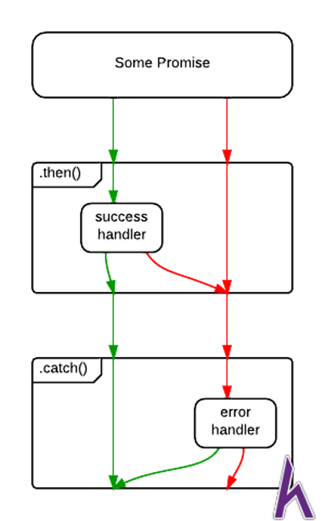

# ECMAScript là gì ? (ES)

- Tiêu chuẩn ECMAScript (viết tắt là ES) là một trong những tiêu chuẩn của ngôn ngữ Javascript khá phổ biến nhất hiện nay. Ta sẽ xem lại lịch sử ra đời của tiêu chuẩn nay:

- Vào thời kỳ cạnh tranh thị phần trình duyệt, Brendan Eich đã phát triển một ngôn ngữ đặc tả kịch bản cho trình duyệt Netscape, lúc đầu gọi là Mocha, rồi sang LiveScript rồi cuối cùng thành Javascript.
12-1995, Sun Microsystem và Netscape công bố Javascript, 3-1996 trình duyệt Netscape 2.0 đã hỗ trợ ngôn ngữ này. Tuy nhiên Microsoft cũng ra mắt một ngôn ngữ tương tự là JScript hỗ trợ cho trình duyệt IE 3.0 (việc đổi tên để tránh bản quyền)
- Netscape đã đưa Javascript tới ECMA International, đây là một tổ chức chuẩn hóa thông tin và hệ thống giao tiếp. Và việc chuẩn hóa ngôn ngữ Javascript được gọi là ECMA-262. Rồi cái tên ECMAScript hình thành từ đây
- Trong quá trình hình thành và phát triển tiêu chuẩn này, bước ngoặt lớn nhất là 2015, tiêu chuẩn ECMAScript 6 (ES6, ES2015) đánh dấu sự thay đổi rất lớn ngôn ngữ Javascript về cú pháp lẫn tính năng.

> Ngoài tiêu chuẩn ECMAScript là tiêu chuẩn phổ biến, thì có những tiêu chuẩn cũng có tiếng khác như Typescript.

# Cơ chế bất đồng bộ 

## Xử lý đồng bộ (Synchronous)

- Khi dòng code hoàn thành thì mới chạy dòng code tiếp theo.
- Nếu dòng code thực hiện quá lâu sẽ chuyển sang trạng thái chờ.

## Xử lý bất đồng bộ (Asynchronous)
- Có thể bỏ qua trạng thái chờ nếu không cần thiết và thực hiện các dòng code tiếp theo.
- Mặt tốt : giúp chúng ta xử lý nhiều công việc xen kẽ với nhau để tiết kiệm thời gian. 
- Mặt xấu là làm chương trình mình viết phức tạp lên, và ta phải hiểu rõ nguyên lý hoạt động của bất đồng bộ, nếu không sẽ dính những trường hợp như cái tiền đề chưa làm mà đã xử lý cái kết quả.

### Cơ chế hoạt động của Javascript.
- Call Stack: Vùng nhớ đặc biệt trên chip máy tính nhằm để phục vụ thực thi các dòng lệnh (cụ thể ở đây là các hàm). Stack là hàng đợi theo kiểu LIFO (Last In First Out) nghĩa là cái gì vào cuối thì ra đầu.
- Heap: vùng nhớ dùng để chứa kết quả tạm thời để thực thi các hàm trong stack.
- Callback Queue / Message Queue: khi các dòng lệnh cần thời gian chờ, ta sẽ khai báo các function callback xử lý sau khi dòng lệnh đó đã hoàn thành. Thì các task đó sẽ được đẩy vào đây. Queue là hàng đợi theo kiểu FIFO (First In First Out) có nghĩa cái gì vào trước là xử lý trước.
- Event Loop: có thể giải thích đơn giản là nó là một vòng lặp vô tận, và chỉ 1 công việc duy nhất là lấy các task từ Call Stack hoặc Callback Queue. Đầu tiên sẽ xử lý CallStack trước, sau khi Call Stack trống thì nó sẽ kiểm tra Callback Queue để thực hiện.

    
    
## Promise
- Promise object đại diện cho việc hoàn thành kết quả (hoặc sự thất bại) từ một lệnh bất đồng bộ, và giá trị kết quả của lệnh đó.

- Mục đích của Promise là cơ chế của nó giúp bạn thực hiện các tác vụ đồng bộ hơn và tránh rơi vào tình trạng callback hell hay pyramid of doom, là tình trạng dùng các callback lồng nhau quá nhiều .
- Ta sẽ tạo promise object thông qua class Promise, class Promise lúc khởi tạo sẽ chứa 1 function để thực thi các tác vụ bất đồng bộ. Function sẽ có 2 tham số:

    - resolve: hàm được gọi khi promise hoàn thành.
    - reject: hàm được gọi khi có sự cố.

```js

var promise = new Promise(function(resolve, reject) {

    setTimeout(function() {
    
        resolve('foo');
    
    }, 1000);
    
});
    
promise.then(function(value) {
    
    console.log(value);
    
});
    
console.log(promise);
```

- Ta sẽ tạo ra một promise object; tại function bên trong, ta hẹn sau 1 giây sẽ gọi function resolve với kết quả ‘foo’.
- Để xử lý khi promise có kết quả ta sẽ dùng phương thức then, rồi viết callback trong đó log ra value khi mà có kết quả.

### Cơ chế hoạt động của Promise

- Một Promise có 1 trong 3 trạng thái sau:

    -pending: trạng thái khởi tạo.
    -fulfilled: có nghĩa thao tác đã hoàn thành thành công.
    -rejected: có nghĩa là thao tác thất bại.
-Một promise pending có thể thành fulfilled với kết quả, hoặc thành rejected với nguyên nhân (error). Khi option đó diễn ra, các handler liên quan sẽ thực hiện.
    
- Ví dụ: Ta sẽ thử viết 1 Promise hoàn chỉnh có then và catch
```js

var promise = new Promise(function(resolve, reject) {

  var value = Math.random()

  if (value > 0.5) {

    resolve(value)

  }

  reject('error')

});


promise.then(function(value) {

  console.log(value)

}).catch(function(error) {

  console.log(error)

})
```
- Ta lấy 1 giá trị ngẫu nhiên, nếu lớn hơn 0.5 thì resolve nó ra, còn không thì reject lỗi.

    

- Ngoài ra, ta có thể viết như thế này:
```js
var promise = new Promise(function(resolve, reject) {
  var value = Math.random()
  if (value > 0.5) {
    resolve(value)
  }
  reject('error')
});

function onSuccess(value) { console.log(value) }
function onError(error) { console.log(error) }
promise.then(onSuccess, onError)
```

### Tại sao phải sử dụng Promise?


- Khi mà ta sử dụng callback function, ta phải viết callback xử lý tính toán ngay lập tức (khi mà thực hiện các thao tác bất đồng bộ) nên khi mà xảy ra quá nhiều thao tác bất đồng bộ đang diễn ra, sẽ dẫn đến tình trạng các callback function lồng vào nhau.

- Còn ở Promise, nó làm 1 bản cam kết sẽ thực hiện trong tương lai, ta không cần phải viết xử lý then ngay lập tức mà có thể để promise object lại đến khi sau này cần mới thực hiện.

- Ví dụ: Ta cần chạy lệnh bất đồng bộ nhưng chưa cần viết hàm xử lý khi có kết quả.
```js
var promise = new Promise(function(resolve, reject) {
   setTimeout(function callback() {
       console.log(8)
       resolve(8)
   }, 3000)
}) //8
```

- Khi chạy kết quả ta có thể thấy giá trị log 8 đã thực hiện, có nghĩa khi ta tạo một object promise, thì thao tác bất đồng bộ đã được thực hiện. Và khi resolve hay reject thì kết quả của xử lý bất đồng bộ này vẫn được lưu lại trong promise. Khi nào cần thì ta có thể viết hàm xử lý kết quả này.

- Promise có thể hiểu là 1 biến chứa kết quả cuộc 1 lần thực hiện bất đồng bộ. Nó khác với các xử lý callback là ta có thể mang vác cái biến này đi khắp nơi trong code mà ta thấy phù hợp. Tại đó gọi hàm then chứa callback xử lý.

- Vậy khi xử lý quá nhiều lệnh bất đồng bộ thì sao. lúc đó mỗi bất đồng bộ là một object promise, ta sẽ gom các promise này lại rồi xử lý tại promise all như sau:
```js

var promise1 = new Promise(function(resolve, reject) {
   setTimeout(function callback() {
       resolve(8)
   }, 3000)
})

var promise2 = new Promise(function(resolve, reject) {
   setTimeout(function callback() {
       resolve(2)
   }, 1000)
})

Promise.all([promise1, promise2]).then(function (values)  {
    console.log(values)
});
// [ 8, 2 ]
```
- Như vậy, ta đã tránh được tình trạng callback hell khi có thể tách biệt các xử lý bất đồng bộ ra riêng cho đến khi tất cả kết quả bất đồng bộ đã có.

> Lưu ý: Nếu trong một các promise có lỗi, thì promise.all sẽ xử lý phần catch thay vì xử lý then.
### Promise chaining
- Promise còn hỗ trợ cho chúng ta một kỹ thuật khá hay giúp ta kết nối các promise liên tiếp lại với nhau. Vì phương thức then (ở trường hợp promise thành công) khi return giá trị thì nó sẽ tạo một promise khác bọc lại giá trị đó, ta có thể tạo nên phương thức then phía sau để kết nối tiếp.

    

```js
new Promise(function(resolve, reject) {
  setTimeout(() => resolve(1), 1000);
}).then(function(result) {
  console.log('1:'+result)
  return result + 1
}).then(function(result) {
  console.log('2:'+result)
  return new Promise(function(resolve, reject) {
      setTimeout(() => resolve(result * 2), 1000);
  });
}).then(function(result) {
  console.log('3:'+result)
});
// 1:1
// 2:2
// 3:4
```

- _Lưu ý_: Promise chaining phải cho các phương thức then nối liền nhau mới xử lý tuần tự. Tránh trường hợp viết như thế này:

```js
var promise = new Promise(function(resolve, reject) {
  setTimeout(function () { resolve(1) }, 1000);
})

promise.then(function(result) {
  console.log(result); // 1
  return result * 2;
});

promise.then(function(result) {
  console.log(result); // 1
  return result * 2;
});

promise.then(function(result) {
  console.log(result); // 1
  return result * 2;
});
```

- Bản chất, ta đang viết 3 phương thức xử lý kết quả của promise đó:
    

## Async/Await là gì?
- Async/Await là một tính năng ra đời từ ES7 nhằm giúp ta code bất đồng bộ nhìn trong đồng bộ hơn, giúp code dễ nhìn hơn và dễ sử dụng. Trong đó:

    - Async function là một khái niệm định nghĩa cho hàm bất đồng bộ. Hàm bất đồng bộ này sẽ thực hiện tách rời so với phần code còn lại của Event Loop, và trả về một Promise. Cú pháp và cấu trúc của Async function làm nhìn giống chuẩn các hàm đồng bộ.
    - Await là một cú pháp giúp tạm dừng (block) code để đợi lấy kết quả từ một Promise (Await không hoạt động với callback), và Await chỉ sử dụng được khi nằm trong Async function.
- Ví dụ: Ta sẽ viết 1 function dùng Async/Await để xử lý 1 Promise

    - Khai báo function returnPromise khi gọi sẽ return 1 promise, sau 3 giây thì promise sẽ resolve kết quả.
    - Khai báo function asyncFunction dùng tính năng async/await, khi gọi function returnPromise  sẽ dùng await để đợi kết quả.

```js
function returnPromise() {
    return new Promise(function(resolve,reject) {
      setTimeout(function() {
        resolve('finished')
      }, 3000)
    })
}
async function asyncFunction() {
  console.log('calling')
  var result = await returnPromise()
  console.log(result)
}
asyncFunction()
console.log('kteam')
//calling
//kteam
//finished
```
- Như vậy:

    - Khi gọi asyncFunction đầu tiên thì chương trình sẽ log ‘calling’, nhưng khi chương trình await nên chương trình thực hiện log ‘kteam’ tiếp theo.
    - Sau 3 giây thì returnPromise có kết quả, lúc đó asyncFunction thực hiện tiếp phần code còn lại.
## Async/Await và Promise
- Nếu chúng ta xem qua, sẽ nghĩ rằng khi sử dụng Async/Await thì không cần phải sử dụng Promise nửa. Cũng không hẳn là vậy, vì bản chất khi ta sử dụng Async/Await chính là ta sử dụng gián tiếp Promise, khi async function return thì nó sẽ trả về 1 Promise, nếu ta hiểu bản chất sẽ biết cách áp dụng triệt để:

```js
function returnPromise() {
    return new Promise(function(resolve,reject) {
      setTimeout(function() {
        resolve(5)
      }, 3000)
    })
}
async function asyncFunction() {
  var result = await returnPromise()
  return result + 5
}
var promise = asyncFunction()
promise.then(function (value) {
  console.log(value)
})//10
```
## Cách sử dụng Async/Await hiệu quả
